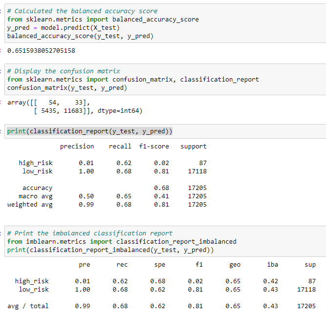
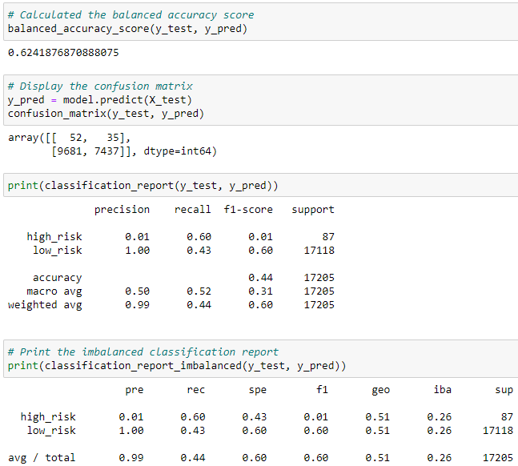

# Credit_Risk_Analysis
## Overview
In this project we will look at how different factors are used to predict if someone is a high or low credit risk.  We will look at oversampling, undersampling and a combintaion of training data will impact the final testing data.

## Results
* Naive Random Oversampling results in an accuracy of about 65.2%, with a precision of 99% with a recall of 68%

* SMOTE Oversampling results in an accuracy of about 62.4%, with a precision of 99% with a recall of 66%

* Undersampling results in an accuracy of 62.4%, with a precision of 99% with a recall of 44%

* Combination (over and undersampling) results in an accuracy of 51.6%, with a precision of 99% with a recall of 58%

* Balanced Random Forest results in an accuracy of 75.4%, with a precision of 99% with a recall of 87%

* Easy Ensemble AdaBoost Classifier results in an accuracy of 93.2% with a precision of 99% and a recall of 94%

## Summary
While all models results in a vary high precision of 99% the are accuracy of the models are much lower with the exception of the Easy Ensemble AdaBoost Classifier and Balanced Random Forest.  THe Easy Ensemble AdaBoost Classifier results in an accuracy of over 90% and also with a recall of 94%.  The Balanced Random Forest results in the next best results with an accuracy of 75% along with a recal of 87%.  I would use teh Easy Ensemble AdaBoost Classifier as it has the highest accuracy and recall percent.
